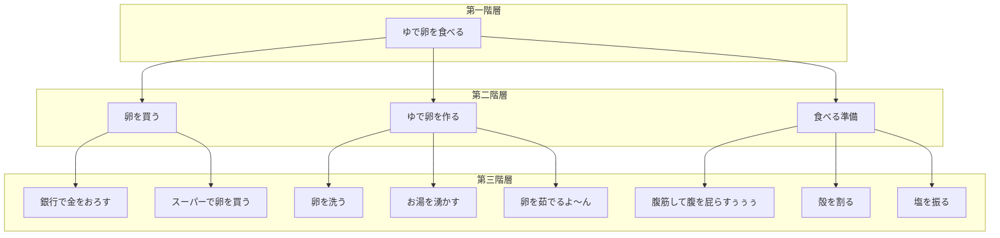

```mermaid
graph TD;
    
    id1["ゆで卵を食べる"]
    id2["卵を買う"]
    id3["ゆで卵を作る"]
    id4["食べる準備"]
    subgraph 第一階層
    id1
    end
    subgraph 第二階層
    id2
    id3
    id4
    end
    id1-->id2
    id1-->id3
    id1-->id4
    id5["銀行で金をおろす"]
    id6["スーパーで卵を買う"]
    subgraph 第三階層
    id2-->id5
    id2-->id6
    id7["卵を洗う"]
    id8["お湯を湧かす"]
    id9["卵を茹でるよ～ん"]
    id3-->id7
    id3-->id8
    id3-->id9
    id10["腹筋して腹を屁らすぅぅぅ"]
    id11["殻を割る"]
    id12["塩を振る"]
    id4-->id10
    id4-->id11
    id4-->id12
    end
```